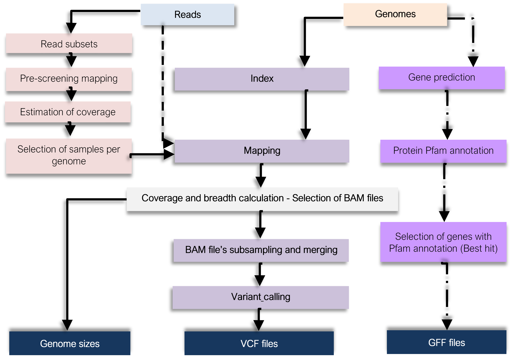

Input_pogenom pipeline
======================

# 1. Objective #

This pipeline generates the required input file for POGENOM. The aim of this pipeline is to increase the reproducibility of the data analysis and to simplify the use of POGENOM, especially for large datasets.

POGENOM takes as input a file of the variant call format (a VCF file). This file is generated by mapping one or several metagenomic samples, (paired) read files, against a reference genome with a read-aligner and calling variants using a variant caller. These steps are automatically done by this pipeline.

# 2. Description #

The pipeline can produce VCF and GFF files for multiple genomes in parallel and will for each genome base the variant calling only on those metagenome samples that have a coverage depth and breadth above user-specified values. The pipeline can also do a quick pre-screening by mapping a subset of the reads from each sample. Then, it estimates the coverage of the samples and determines which should be included. For the mapped samples, the pipeline can down-sample to a target median coverage, to avoid biases due to uneven coverage.

# 3. List of required software/packages/database #

-	[snakemake](https://snakemake.readthedocs.io/en/stable/) v5.5.0
-	[bowtie2](http://bowtie-bio.sourceforge.net/bowtie2/) v2.3.4.3
-	[samtools](http://www.htslib.org/) v1.9
-	[vcflib](https://github.com/vcflib/vcflib) v1.0.0_rc3
-	[freebayes](https://github.com/ekg/freebayes) v1.3.1
-	[picard](https://broadinstitute.github.io/picard/) v2.21.6
-	[seqtk](https://github.com/lh3/seqtk) v1.3
-	[python](https://www.python.org/) v3.7.6  
-	[numpy](https://numpy.org/) v1.18.1

Optional:

-	[Prodigal](https://github.com/hyattpd/Prodigal) v.2.6.3
-	[Hmmer](http://hmmer.org/) v3.3
-	[Pfam-A hmm](https://pfam.xfam.org/) database v31.0

# 4. Step description #

The following figure resumes the pipeline steps.

## 4.1. Sample pre-screening ##

This step is realised when the user defines mode: “prefilt” in the pipeline configuration file ``Input_POGENOM_config.json``, as explained in section 6.2.1.

A user-defined fraction of paired reads per sample is created using [seqtk](https://github.com/lh3/seqtk) v1.3. These reads are then mapped to a reference genome, and coverage is estimated: *calculated Median coverage/fraction*. Samples with Estimated median coverage higher than the user-defined threshold will be kept for further analysis, as explained in section 4.2.

## 4.2.	Sequence analysis ##

The following paragraph describe the sequence analysis when using default parameters (the user can modify these parameters, as described in section 6.2.1):

[Bowtie2](http://bowtie-bio.sourceforge.net/bowtie2/) is used for mapping of metagenome reads to the *Metagenome-Assembled Genomes* (MAGs). As default, it is required for 95% of the read length to be aligned. The resulting SAM files are sorted and converted to BAM with [samtools](http://www.htslib.org/) v1.9. [picard](https://broadinstitute.github.io/picard/) v2.21.6 is used to include sample names in BAM files.  Median coverage is calculated, ignoring positions that had not acquired any reads. To avoid mapping artefacts such as high coverage of only limited genomic regions, as default ≥40% breadth (fraction of genome covered by at least one read) is needed. It is also wanted a median coverage depth of ≥ 20X (default) to include a sample.

Samples displaying coverage depth values higher than the threshold are downsampled to 20x using Samtools. [picard](https://broadinstitute.github.io/picard/) v2.21.6, a haplotype-based variant detector, is used for single nucleotide polymorphism calling. SNP-calling is performed once per MAG, after combining BAM files from the approved samples into a multi-sample BAM file, using Freebayes with the --pooled-continuous flag. SNPs are called when supported by ≥4 reads (default) and with an allele frequency of ≥1% (default). Calls are filtered, removing any sites with an estimated probability of not being polymorphic less than Phred 20 (default, corresponding to a 99% probability of being a real SNP), using [vcflib](https://github.com/vcflib/vcflib) v1.0.0_rc3.

## 4.3. Generation of GFF files ##

This step is realised when the user defines annotation: “yes” in the pipeline configuration file ``Input_POGENOM_config.json``, as explained in section 6.2.1. Genes are predicted from contig’s MAGs with [Prodigal](https://github.com/hyattpd/Prodigal) v.2.6.3, running the program on each MAG separately in default single genome mode. Predicted genes are annotated against the database [Pfam-A hmm](https://pfam.xfam.org/) version 31.0, using [hmmsearch](http://hmmer.org/) version 3.3, and selecting hits with *E-value < 0.001*. Genes annotated are selected, keeping the best Pfam hit (the highest score), and a GFF file corresponding to those genes is created. This GFF file will be a POGENOM input file.

# 5. Installation #

The easiest and recommended way to install this pipeline is through [conda](https://docs.conda.io/en/latest/) in an isolated environment. Below an example of how to set up the pipeline (including its required software) in an environment:

Clone the repository from GitHub:  	

  	git clone https://github.com/lfdelzam/MASTER

Now, go to the directory Input_POGENOM:     

  	cd MASTER/Input_POGENOM

This directory contains:

	• Empty RAW_DATA/Reads and RAW_DATA/Genomes folders
	• Config_file, snakefiles and src directories
	• The Input_POGENOM.sh script.

Create the virtual environment (named ip_env) using the command:

  	conda env create -f config_files/Input_POGENOM_conda_env_setup.yaml

The generation of GFF files is optional. If the user wants the pipeline to create these files, the user should install the required software, using the following commands:

	Conda activate ip_env
	Conda install -c bioconda -c conda-forge prodigal hmmer

And answer y to the question.

Pfam database can be downloaded [here](ftp://ftp.ebi.ac.uk/pub/databases/Pfam/releases/Pfam31.0/Pfam-A.hmm.gz)

# 6. Usage #

## 6.1. Organise your data ##

The pipeline can analyse several datasets with samples (paired fastq read files) and several genomes (fasta files). The minimum data required is one dataset with one pair of read files (forward and reverse) and one genome. Input data (reads and genomes) must be stored in the directory *RAW_DATA/*, as explained below:

### 6.1.1. READS ###

Go to the directory Input_POGENOM/RAW_DATA/Reads/:

	cd Input_POGENOM/RAW_DATA/Reads/

Create a directory for each dataset:    

	mkdir <dataset_name>

There must be a least one dataset.

Copy or link (recommended) reads to this directory:

    cp path/to/reads/* <dataset_name>/. or ln -s path/to/reads/* .

Make sure that read file names follow the syntax:

forward reads:  ``<sample_name><fwd_index><reads_ext>``
e.g., P6071_505_R1.fq.gz, where sample_name = P6071_505, fwd_index = _R1, and reads_ext = .fq.gz

reverse reads: ``<sample_name><rev_index><reads_ext>``
e.g., P6071_505_R1.fq.gz, where sample_name = P6071_505, rev_index = _R2, and reads_ext = .fq.gz

### 6.1.2. GENOMES ###

Go to the directory cd Input_POGENOM/RAW_DATA/Genomes/:

	cd Input_POGENOM/RAW_DATA/Genomes/

Create a directory for each dataset:    

 	mkdir <dataset_name>

There must be a least one dataset.

Copy or link (recommended) genomes in FASTA format to this file:

    cp path/to/Genomes/* <dataset_name>/. or ln -s path/to/Genomes/* <dataset_name>/.

Make sure that genome names follow the syntax: ``<genome_name><genome_ext>``
e.g., P6071_521_bin125.fa, where genome_name = P6071_521_bin125, and genome_ext = .fa

## 6.2. How to run the pipeline ##

If you are using conda, activate the pipeline environment by typing:

    conda activate ip_env

If you are not in the working directory, go there using the command::

    cd path/to/Input_POGENOM

### 6.2.1. Set parameters in the config file ###

In the ``Input_POGENOM_config.json`` file, set the parameters to be used. It contains the pipeline parameters. The following parameters can be set:

	"workdir": "absolute/path/to/Input_POGENOM",
		It must be an absolute path.

	"dataset": "name of the dataset to be analysed",
		It cannot be empty.

	"mode": "prefilt",
		When "mode": "prefilt", the pipeline will do a quick prescreening by mapping a subset of the reads from each sample, to estimate the coverage of the samples and determine which should be included. If no prescreening (prefilt) is required, then an empty string can be set ("mode": "",).

	"fraction": "0.15",
		Fraction of reads to be subsampled when running the pipeline using "mode": "prefilt".
		Lowering the fraction increases the uncertaintly in the coverage estimates. Increasing the fraction increases the size of the directory <temp_sub_Reads_dir>/Reads/ and the runtime. Required is mode "prefilt" used.

	"temp_sub_Reads_dir": "PREFILT",
		Directory storing the subsampled reads when running the pipeline using "mode": "prefilt". The size of this directory will be "fraction" * the size of "dataset". Required is mode "prefilt" used.

	"remove_subreads": "yes",
		Remove the directory of subsampled reads (i.e., <temp_sub_Reads_dir>/Reads/) after usage. This directory is created during sample prescreening, when "mode": "prefilt" is used.

	"min_coverage": 20,
		Minimum median coverage depth per sample per genome. Integer. Samples below this threshold will not be included in the subsequent comparative analysis.
		When "mode": "prefilt", and "fraction" : "0.10", a "min_coverage" value lower than 10 will select all samples, and the prescreening will be obsolete. It cannot be empty.

	"min_breadth": 40,
		Minimum coverage breadth (percentage of genome covered) per sample per genome. Integer. It cannot be empty.

	"min_bsq_for_cov_median_calculation": 15,
		Minimum base quality when counting the number of bases per genome position during coverage calculation. Integer. It cannot be empty.

	"threads": 15,
		Number of threads. Integer. It cannot be empty.

	"genomes_ext": ".fa",
		Extention used on genome files.

	"reads_ext": ".fq.gz",
		Extention used on read files. For instance, ".fq.gz" if files are named "sample_R1.fq.gz & sample_R2.fq.gz".

	"fwd_index": "_R1",
		Index used to define forward reads.

	"rev_index": "_R2",
		Index used to define reverse reads.

	"bowtie2_params": "--ignore-quals --mp 1,1 --np 1 --rdg 0,1 --rfg 0,1 --score-min L,0,-0.05",
		Bowtie2 mapping parameters. The –score-min then gives the minimum score that is allowed to report an alignment. Here, it represents a 95% identity threshold, as explained in http://bowtie-bio.sourceforge.net/bowtie2/manual.shtml.

	"mapqual": 20,
		Read mapping quality threshold in BAM files. Integer. Parameter used in samtools view -	q {}. It cannot be empty.

	"samtools_view_alignment_extra_filters": "-f 2 -F 1024",
		Filters used for selecting mapped reads to be included in the BAM file. Here it selects only paired reads (-f 2) and avoids optical duplicates (-F 1024). If no filters are required, then an empty string can be set ("samtools_view_alignment_extra_filters": "",)

	"freebayes_parameters": "-C 4 -p 1 --pooled-continuous --read-max-mismatch-fraction 0.05 -- min-alternate-fraction 0.01 -q 15",
		Parameters used during variant calling. By default, freebayes exclude duplicates marked as such in alignments. To include duplicates, the tag ``--use-duplicate-reads`` and remove "-F 1024" in "samtools_view_alignment_extra_filters" are required.  
		The flag ``-q --min- base-quality Q``, exclude alleles from analysis if their supporting base quality is less than Q.

	"vcffilter_qual": "'QUAL > 20'"
		Filtering variant calling. It cannot be empty. Here it removes any sites with an estimated probability of not being polymorphic less than Phred 20 (corresponding to 99% probability of being a real SNP).

	"snakemake_extra_params": "<command line 1>, <command line 2>",
		Snakemake extra command line options (comma-separated) to be used. If no extra command line, an empty string can be set "snakemake_extra_params": "".

	"annotation": "yes",
		Set “yes” when prediction and Pfam annotation of genes are required, otherwise, set “no”.  

	"pfam_db_path": "/absolute/path/to/Pfam-A.hmm",
		Here, the user set the path to the Pfam-A.hmm database. This parameter is mandatory when "annotation": "yes".

	"evalue_pfam": "0.001"
		E-value threshold used when annotating genes against Pfam database. This parameter is mandatory when "annotation": "yes".

To access and modify this file, you can use the following command:

	nano config_files/Input_POGENOM_config.json

Modify the required items and save the file. Use Ctrl +x and answer y, to save the modifications and exit the file.

## 6.2.2. Run ##

The workflow is run with the following command:

    bash Input_POGENOM.sh

If you need to set a different path to the config file ( flag -d=<absolute path to configFile> ), please do not use relative paths (~/ nor ./)

If you are using conda, before exiting the workflow, the environment needs to be deactivated using the following command:

    conda deactivate

# 7. Output description #

# 7.1. Intermediate files #

A)	01_INDEXING
 The indexed genome file(s) are stored in this directory. A subdirectory per dataset and genome is created.  Example of filename:

	01_INDEXING/<dataset>/<genome_name>/

B)	02_MAPPING
 A subdirectory per dataset and genome is created. The BAM files of mapped reads corresponding to each genome and sample are stored here. The read group (@RG) information for each BAM file corresponds to the sample name. Example of filename:

	02_MAPPING/<dataset>/<genome_name>/<sample_name>_<genome_name>_mpq_<min mapping_quality>_RG_sorted_position.bam

The Bowtie2 log files are stored in this directory. Example of filename:

	02_MAPPING/log_bowtie2/<dataset>/<genome_name>/<sample_name>_<genome_name>_mpq_<min mapping quality>.log

C)	03_MPILEUP
A subdirectory per dataset and genome is created. It contains the samtools mpileup file, in which the coverage per genome position is stored. Example of filename:

	03_MPILEUP/<dataset>/<genome_name>/<sample_name>_<genome_name>_mpq_<min_mapping_quality>_bq_<min base_quality>_mpileup

D)	04_mergeable
 Files passing the filter (minimum coverage, minimum breadth) are subsampled up to minimum coverage, sorted by position and stored in this directory. Example of filename:

	04_mergeable/<dataset>/params_<parameters>/<genome_name>/<sample_name>_<genome_name>_RG_sorted_position_subsampled.bam
	Where <parameters> is a string of the key parameters used, for instance 'cov_10_bdth_40_mpq_20_bq_15'.

The corresponding log file for these steps is(are):

	log_files/<dataset>_genomes_coverage_breadth.log log_files/<dataset>.<genome_name>.coverage_breadth.log (when "mode": "prefilt")

E)	05_BAM_merged
When the number of BAM files in 04_mergeable/ directory is more than 1, the files are merged into one BAM file per genome. The read group (@RG) information from each BAM file, corresponding to the sample name, is kept.  Example of filename:

	05_BAM_merged/<dataset>/params_<parameters>/<genome_name>_merged_sorted_position.bam

F)	Gene Calling
Gene prediction and PFMA annotation are stored in the directory ``Gene_calling``. A subdirectory is created per dataset and per Genome, Gene_calling/<dataset>/<Genome_name>/. Example of filenames:  

	<Genome_name>_Output_hmmsearch_pfam,
	<Genome_name>_ table_domain_hmmsearch_pfam,
	<Genome_name>_ table_protein_hmmsearch_pfam,
	<Genome_name>_Prodigal.faa, <Genome_name>_Prodigal.fna, <Genome_name>_Prodigal.gff

In the subdirectory Gene_calling/<dataset>/<Genome_name>/best_hit_pfam, the following file are stored: <Genome_name>.faa, which contains the aminoacid sequence of predicted proteins with Pfam annotation; and the file  <Genome_name>.fna, which contains the corresponding gene sequence.
The log files generated during gene prediction are stored in:

	Gene_calling/<dataset>/log_prodigal/<genome_name>.log

## 7.1.1 Intermediate files when "mode": "prefilt" ##

When "mode": "prefilt", the suffix ``_prefilt`` will be added to <dataset> in intermediate files B-E, e.g.,

	05_BAM_merged/<dataset>_prefilt/<genome_name>_merged_sorted_position.bam

Additionally, the directory PREFILT/<dataset> is created and contains the subdirectories:

02_MAPPING, 03_MPILEUP, and params_<parameters>, where <parameters> is a string of the key parameters used, for instance 'cov_10_mpq_20_bq_15_fr_0.15'.

In the subdirectory ``params_<parameters>``, the following files are stored:

Estimated_median_cov_per_sample.tsv, and Selected_samples_genomes.txt. The file names describe their contents.

The directories, 02_MAPPING, and 03_MPILEUP have the same format as described above (Intermediate files). Example of filenames:

	PREFILT/<dataset>/02_MAPPING/params_<parameters>/<genome_name>/<sample_name>_<genome_name>_sorted_position.bam
	Where <parameters> is a string of the key parameters used, for instance 'mpq_20_fr_0.15'.

	PREFILT/<dataset>/03_MPILEUP/params_<parameters>/<genome_name>/<sample_name>_<genome_name>_mpileup
	Where <parameters> is a string of the key parameters used, for instance 'mpq_20_bq_15_fr_0.15'.

The reads used to generate those files are the Reads subsets, which are stored in the folder <temp_sub_Reads_dir>/Reads/<fraction>/.
The corresponding log file for these steps is ``log_files/samples_filter.log``

The Bowtie2 log files generated when mapping Reads subset, are stored in PREFILT/<dataset>/02_MAPPING. Example of filename:

	PREFILT/<dataset>/02_MAPPING/params_<parameters>/log_bowtie2/<genome_name>/<sample_name>_<genome_name>.log

# 7.2. VCF files #

Variant calling files per genome (input for POGENOM) are stored in the directory ``06_VCF``.
Example of filename:    

	06_VCF/<dataset>/params_<parameters>/<genome_name>.vcf
	Where <parameters> is a string of the key parameters used, for instance 'cov_10_bdth_40_mpq_20_bq_15'.

The list of samples used for the generation of the vcf files can be found in the files:

	06_VCF/<dataset>/params_<parameters>/<genome_name>_samples.txt

When no BAM file passes the filter (coverage and breadth), a vcf file cannot be created.
In this case, the corresponding <genome_name>_samples.txt file will contain the following statement: "The genome <genome_name> has not BAM file that passes the filter breadth and coverage. A vcf file cannot be created."

When "mode": "prefilt", the suffix ``_prefilt`` will be added to <dataset> in VCF files, e.g.,

	06_VCF/<dataset>_prefilt/params_<parameters>/<genome_name>.vcf

The corresponding log file for these steps is (are):

	log_files/<dataset>_genomes_vcf_files.log
	log_files/<dataset>.<genome_name>_vcf_files.log (when "mode": "prefilt")

# 7.3. Genome size files #

The size of the genome (number of bases) is stored in file ``<genome_name>.size`` in the directory ``Genome_sizes``. This value may be used later as input for POGENOM.

# 7.4. GFF files #

The GFF file of genes with Pfam annotation (best hit) are stored in the directory ``GFF_files``. This GFF file contains as well as, the sequences of the corresponding contigs (only contigs with Pfam annotated genes). A subdirectory is created for each dataset. Example of filename:

	GFF_files/<dataset>/<genome_name>.gff
